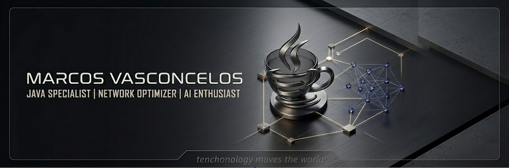

  

---

## 👋 About Me

I am a Software Engineer focused on the **Java** ecosystem, with solid experience in **Agile methodologies (Scrum)** and infrastructure optimization. I believe that cutting-edge technology stems from the synergy between clean code, stable networking, and the transformative power of **Artificial Intelligence**.

Currently focusing on:
- ☕ Building scalable architectures with **Spring Boot**.
- 🤖 Integrating **AI** solutions into enterprise workflows.
- 🌐 Enhancing performance for local and remote network infrastructures.

---

## 🛠️ My Toolbox (Tech Stack)

| Category | Technologies |
| :--- | :--- |
| **Backend** |    |
| **Database** |   |
| **Agile & Ops** |   |
| **Specialties** | 📡 Network Optimization | 🤖 AI Integration | 🖥️ High-Performance Setups |

---

## 🚀 Featured Project

### 🛰️ [NetPulse Optimizer]
*A Java-based local network diagnostic tool designed to analyze jitter, latency, and packet stability.*
- **Tech Stack:** Java 21, Spring Shell, Pcap4j.
- **Status:** In Development (Sprint 2).

---

## 📫 Let's Connect

---

  <i>"Technology doesn't just change the world; it moves it."</i>

